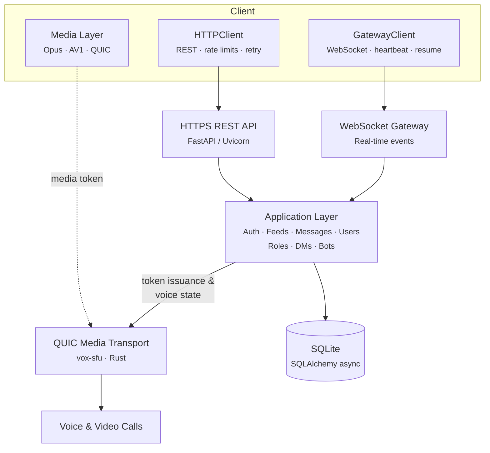

# Vox

**A federated, end-to-end encrypted chat platform with voice and video support.**

Vox is a self-hosted communication server where one server equals one community. Built with Python and FastAPI, Vox provides real-time messaging over WebSockets, E2E encrypted direct messages via MLS, and voice/video calling over QUIC media transport.

!!! info "Python 3.11+"
    Vox requires Python 3.11 or later and uses fully async I/O throughout the stack.

---

## Key Features

-   :material-earth:{ .lg .middle } **Federation**

    ---

    Connect your Vox server to others. Federated identity, cross-server messaging, and configurable federation policies (open, allow-list, or closed).

-   :material-lock:{ .lg .middle } **End-to-End Encrypted DMs**

    ---

    Direct messages are protected with the Messaging Layer Security (MLS) protocol. Group DMs support multiple recipients with forward secrecy.

-   :material-video:{ .lg .middle } **Voice & Video via QUIC SFU**

    ---

    Real-time voice and video calls powered by a Rust-based Selective Forwarding Unit (SFU) using QUIC transport for low-latency media delivery.

-   :material-robot:{ .lg .middle } **Bots & Webhooks**

    ---

    Extend your server with bot accounts and incoming/outgoing webhooks. Full API access for automation and integrations.

-   :material-shield:{ .lg .middle } **Moderation Tools**

    ---

    Role-based permissions, audit logging, message management, and server-level moderation controls to keep your community safe.

-   :material-key:{ .lg .middle } **WebAuthn & MFA**

    ---

    Passwordless authentication with WebAuthn/passkeys and TOTP-based two-factor authentication for account security.

---

## Architecture

- **REST API** -- CRUD operations for users, feeds, messages, roles, invites, and server configuration.
- **WebSocket Gateway** -- Persistent connections for real-time event dispatch (messages, presence, typing indicators).
- **QUIC Media Transport** -- Rust-based SFU handling voice and video streams with low latency.

---

## Documentation

| Section | Description |
|---|---|
| [Getting Started](getting-started/index.md) | Installation, configuration, and quick start guide |
| [Getting Started: Installation](getting-started/installation.md) | Prerequisites and setup instructions |
| [Getting Started: Configuration](getting-started/configuration.md) | Full configuration reference |
| [Getting Started: Quick Start](getting-started/quick-start.md) | Tutorial to get up and running |

---

## Tech Stack

| Component | Technology |
|---|---|
| HTTP Server | FastAPI + Uvicorn |
| Database | SQLAlchemy 2.0 async + aiosqlite |
| Real-time | WebSockets |
| Media | QUIC transport via vox-sfu (Rust) |
| Auth | Argon2 password hashing, JWT sessions, WebAuthn, TOTP |
| Encryption | MLS for E2E encrypted DMs |
| Federation | DNS-based discovery, signed requests |
